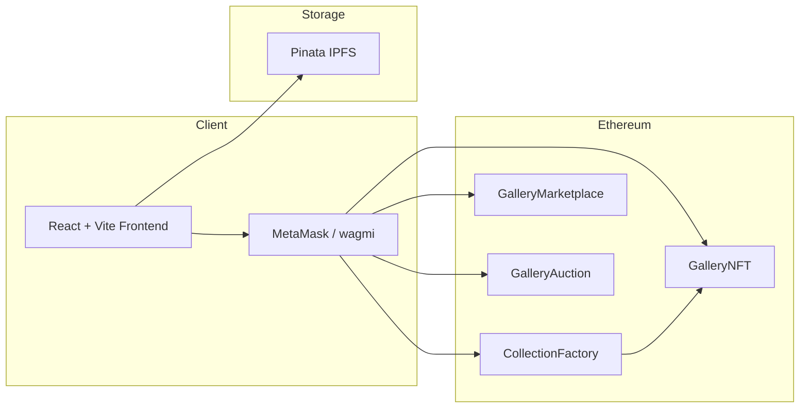

# Golden Art Gallery

**Golden Era** is a luxury NFT art marketplace — a full-stack decentralized application for discovering, collecting, minting, and trading digital art on Ethereum.

The platform pairs a polished React frontend with audited-style Solidity contracts for collection deployment, fixed-price sales, and on-chain auctions. Artists can launch curated galleries; collectors can browse exhibitions, purchase listed works, and participate in live auctions — all with wallet-native authentication and ERC-2981 royalty support.

---

## Features

### Marketplace (Frontend)

| Area | Capabilities |
|------|--------------|
| **Discovery** | Home gallery, curated collections, featured artworks, global search |
| **Collections** | Browse exhibition halls, view collection details and floor activity |
| **Trading** | Fixed-price buy/sell with on-chain escrow |
| **Auctions** | Create auctions, place bids, settle expired sales |
| **Creator tools** | Deploy collections, mint NFTs, upload metadata via IPFS (Pinata) |
| **Wallet** | MetaMask connection via wagmi/ethers; portfolio view in **My NFTs** |

The UI uses a dark luxury theme (gold, ivory, deep black), museum-frame card layouts, motion-driven transitions, and a unified button interaction system.

### Smart Contracts

| Contract | Role |
|----------|------|
| **`GalleryNFT`** | ERC-721 collection with per-token artist royalties (ERC-2981) and a platform mint fee |
| **`CollectionFactory`** | Deploys new `GalleryNFT` collections (5% royalty, 0.0001 ETH mint fee) |
| **`GalleryMarketplace`** | Fixed-price listings with NFT escrow, marketplace fee, and royalty distribution |
| **`GalleryAuction`** | Timed auctions with bid escrow, settlement, marketplace fee, and royalties |

All sale paths enforce **ReentrancyGuard** protection and use a pull-payment pattern where applicable.

---

## Architecture



---

## Tech Stack

| Layer | Technologies |
|-------|--------------|
| **Frontend** | React 18, TypeScript, Vite 6, Tailwind CSS v4, Radix UI, Motion |
| **Web3** | ethers v6, wagmi v3, viem, TanStack Query |
| **Contracts** | Solidity 0.8.20, Hardhat, OpenZeppelin Contracts |
| **Metadata** | Pinata IPFS (proxied in dev via Vite) |

---

## Project Structure

```
Golden-Art-Gallery/
├── frontend/                  # Vite + React dApp
│   ├── public/                # Static assets (favicon, logo)
│   ├── src/
│   │   ├── abis/              # Contract ABIs consumed by the UI
│   │   ├── components/        # Shared UI (Navbar, cards, modals)
│   │   ├── pages/             # Route-level views
│   │   ├── lib/               # Wallet context, wagmi config
│   │   ├── utils/             # Contract helpers, Pinata uploads
│   │   └── styles/            # Global theme and design tokens
│   └── vite.config.ts
│
└── contracts/                 # Hardhat project
    ├── contracts/             # Solidity sources
    ├── scripts/               # Deployment scripts
    ├── test/                  # Contract test suite
    └── hardhat.config.js
```

---

## Prerequisites

- **Node.js** 18+ (LTS recommended) and npm
- **MetaMask** (or compatible EVM wallet) for dApp interaction
- **Pinata account** for IPFS metadata and image uploads (optional for read-only browsing)
- For testnet deployment: an **Infura** (or other RPC) key and a funded deployer wallet

---

## Getting Started

### 1. Install dependencies

```bash
# Frontend
cd frontend
npm install

# Contracts (separate terminal)
cd ../contracts
npm install
```

### 2. Run a local blockchain

```bash
cd contracts
npx hardhat node
```

Keep this terminal running.

### 3. Deploy contracts locally

In a new terminal:

```bash
cd contracts
npx hardhat run scripts/deploy-local.js --network localhost
```

Copy the printed addresses for the marketplace, auction, and factory contracts.

### 4. Configure the frontend

Create `frontend/.env.local` (never commit secrets):

```env
VITE_FACTORY_ADDRESS=0x...
VITE_MARKETPLACE_ADDRESS=0x...
VITE_AUCTION_ADDRESS=0x...

# Optional — required for minting / metadata upload
VITE_PINATA_API_KEY=your_pinata_api_key
VITE_PINATA_SECRET=your_pinata_secret
```

### 5. Start the development server

```bash
cd frontend
npm run dev
```

Open [http://localhost:3000](http://localhost:3000), connect MetaMask to the Hardhat network (chain ID `31337`), and import a test account from the Hardhat node output if needed.

---

## Environment Variables

### Frontend (`frontend/.env.local`)

| Variable | Description |
|----------|-------------|
| `VITE_FACTORY_ADDRESS` | Deployed `CollectionFactory` contract address |
| `VITE_MARKETPLACE_ADDRESS` | Deployed `GalleryMarketplace` contract address |
| `VITE_AUCTION_ADDRESS` | Deployed `GalleryAuction` contract address |
| `VITE_PINATA_API_KEY` | Pinata API key for IPFS uploads |
| `VITE_PINATA_SECRET` | Pinata secret key |

> During development, Pinata requests are proxied through `/pinata-api` → `https://api.pinata.cloud` (see `frontend/vite.config.ts`) to avoid CORS issues.

### Contracts (`contracts/.env`)

| Variable | Description |
|----------|-------------|
| `INFURA_KEY` | Infura project key for Sepolia RPC |
| `PRIVATE_KEY` | Deployer wallet private key (**never commit**) |

---

## Smart Contract Reference

### `GalleryNFT.sol`

- ERC-721 with per-token URI storage
- ERC-2981 royalty support (artist set at mint time)
- Configurable mint fee forwarded to the platform address

### `CollectionFactory.sol`

- `createCollection(name, symbol, collectionURI)` deploys a new gallery
- Fixed parameters: **5% royalty**, **0.0001 ETH mint fee**
- Maintains a registry of all deployed collections

### `GalleryMarketplace.sol`

- Sellers list NFTs into contract escrow at a fixed price
- Buyers purchase atomically; proceeds split among seller, marketplace, and royalty recipient
- Default marketplace fee: **2.5%** (250 basis points, set at deploy time)

### `GalleryAuction.sol` (`GalleryAuction`)

- Sellers escrow NFTs and define start price + duration
- Bidders compete; highest bid held in escrow until settlement
- Supports cancellation (seller), settlement (after expiry), and pending-return withdrawals

---

## Development Commands

### Frontend

```bash
cd frontend
npm run dev      # Start dev server on port 3000
npm run build    # Production build → frontend/build/
```

### Contracts

```bash
cd contracts
npx hardhat compile                          # Compile Solidity
npx hardhat test                             # Run test suite
npx hardhat node                             # Local JSON-RPC node
npx hardhat run scripts/deploy-local.js --network localhost
npx hardhat run scripts/deploy-local.js --network sepolia   # Testnet deploy
```

After any deployment, update the three `VITE_*_ADDRESS` values in the frontend environment file.

---

## Design

The interface is built around a **digital art gallery** metaphor — exhibition halls, museum frames, and a gold-and-ivory palette. The original visual direction is based on a [Figma design reference](https://www.figma.com/design/G35WYRBsEhcQL3CXFsZMVt/Luxury-NFT-Art-Marketplace).

Brand assets (`frontend/public/favicon.svg`, `logo.svg`) reflect the gallery frame + on-chain provenance concept used throughout the UI.

---

## Security Notes

- Never commit `.env`, `.env.local`, private keys, or Pinata secrets to version control.
- Rotate any credentials that may have been exposed.
- Contracts in this repository are provided for development and demonstration. Conduct a professional audit before mainnet deployment.
- Always verify contract addresses and network selection in your wallet before signing transactions.

---

## License

Smart contracts are released under the **MIT License** (see SPDX headers in `.sol` files). Frontend licensing should be confirmed before redistribution.
